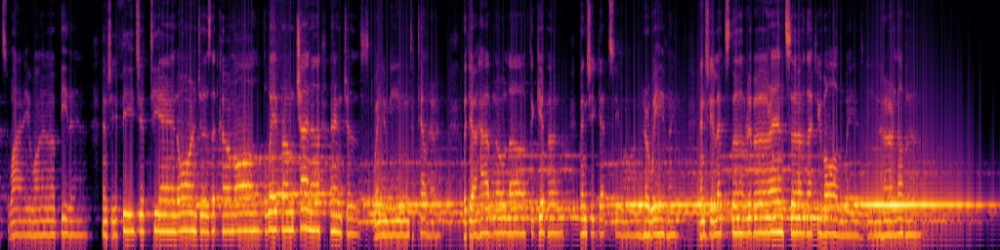

# MelSpecX


A high-performance Python library for generating mel spectrograms from audio files, implemented in Rust with GPU acceleration.

## Features

- Fast mel spectrogram generation using GPU acceleration (thanks to [eugenehp/gpu-fft](https://github.com/eugenehp/gpu-fft))
- Support for various colormaps (inferno, viridis, magma, plasma, etc.) with [colorgrad-rs](https://github.com/mazznoer/colorgrad-rs)
- Configurable FFT parameters and mel scale settings
- Python API and CLI interface
- Efficient memory usage with chunked processing
- High-quality visualization with bilinear interpolation

## Installation

### Prerequisites

- Python 3.8 or higher
- Rust toolchain
- CUDA toolkit (for GPU acceleration)

### From Source

```bash
# Clone the repository
git clone https://github.com/yourusername/melspecx.git
cd melspecx

# Install in development mode
pip install -e .
```

## Usage

### Python API

```python
import melspecx

# Generate a mel spectrogram from an audio file
image_bytes = melspecx.mel_spec_from_path(
    "path/to/audio.wav",
    n_fft=2048,
    win_length=512,
    hop_length=1024,
    f_min=0,
    f_max=8000,
    n_mels=128,
    colormap="inferno",
    width_px=1024,
    height_px=256,
    top_db=60,
    chunk_size=1024
)

# Save the image
with open("spectrogram.png", "wb") as f:
    f.write(image_bytes)
```

### Command Line Interface

```bash
# Basic usage
melspecx generate input.wav output.png

# With custom parameters
melspecx generate input.wav output.png \
    --n-fft 2048 \
    --win-length 512 \
    --hop-length 1024 \
    --f-min 0 \
    --f-max 8000 \
    --n-mels 128 \
    --colormap inferno \
    --width-px 1024 \
    --height-px 256 \
    --top-db 60 \
    --chunk-size 1024
```

## Parameters

- `n_fft`: Number of FFT components (default: 2048)
  - Higher values give better frequency resolution but lower time resolution
- `win_length`: Length of the window function (default: 512)
  - Should be <= n_fft
  - Smaller values give better time resolution
- `hop_length`: Number of samples between successive frames (default: 1024)
  - Controls overlap between windows
- `f_min`: Minimum frequency in Hz (default: 0)
- `f_max`: Maximum frequency in Hz (default: 8000)
- `n_mels`: Number of mel bands (default: 128)
  - Higher values give more detailed frequency representation
- `colormap`: Visualization colormap (default: "greys")
  - Options: "inferno", "viridis", "magma", "plasma", "greys", "blues", "greens", "reds", "purples", "oranges"
- `width_px`: Width of output image in pixels (default: 1024)
- `height_px`: Height of output image in pixels (default: 256)
- `top_db`: Maximum decibel value for normalization (default: 60)
  - Values above this will be clipped
- `chunk_size`: Size of chunks to process at once (default: 1024)
  - Larger values use more memory but may be faster

## Advanced Usage

### Custom Mel Configuration

```python
import melspecx

# Create a custom mel configuration
config = melspecx.create_mel_config(
    sample_rate=22050,
    n_fft=2048,
    win_length=512,
    hop_length=1024,
    f_min=0,
    f_max=8000,
    n_mels=128,
    top_db=60,
    onesided=True,
    chunk_size=1024
)

# Generate mel spectrogram with custom config
mel_spec = melspecx.mel_spectrogram_db_py(config, audio_data)
```

### Logging

The library uses Rust's logging system. To enable logging:

```python
import os
os.environ['RUST_LOG'] = 'melspecx=debug'  # or 'info', 'warn', 'error'
import melspecx
```

or

```bash
export RUST_LOG=info
```

## Performance

MelSpecX uses cross-platform GPU acceleration with [wgpu](https://github.com/gfx-rs/wgpu) for FFT computation and parallel processing with [rayon](https://github.com/rayon-rs/rayon) for mel scale conversion. The performance can be tuned using:

- `chunk_size`: Adjust based on available GPU memory
- `n_fft`: Balance between frequency and time resolution
- `hop_length`: Control overlap between windows

## License

MIT
